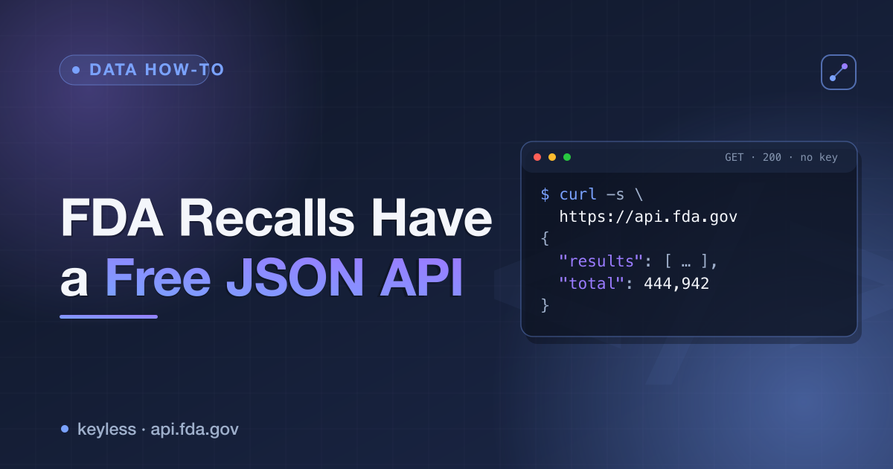

# FDA Recalls JSON API (openFDA) — a cheatsheet



**openFDA** publishes the FDA's recall / enforcement, adverse-event and drug-labeling databases as clean JSON through a free, **keyless** API. No sign-up, no API key, no paid tier. Registering a free key only raises the rate limit — every call below works anonymously.

Base URL: `https://api.fda.gov`

## Recall (enforcement) endpoints

| Endpoint | Purpose | Auth |
|---|---|---|
| `GET /drug/enforcement.json` | Drug recalls (firm, product, reason, class, status). | none |
| `GET /device/enforcement.json` | Medical-device recalls. | none |
| `GET /food/enforcement.json` | Food & cosmetics recalls. | none |
| `GET /drug/event.json` | Adverse-event reports (FAERS). | none |
| `GET /drug/label.json` | Structured product labeling (SPL). | none |

## Query parameters

| Param | Meaning | Example |
|---|---|---|
| `search` | `field:value` filter, Lucene-style (quote + URL-encode multi-word values). | `search=classification:"Class+I"` |
| `count` | Aggregate by a field instead of listing rows. | `count=classification.exact` |
| `limit` | Page size, max **1000**. | `limit=100` |
| `skip` | Offset for paging. | `skip=200` |

## Examples

```bash
# Most-serious (Class I) drug recalls
curl 'https://api.fda.gov/drug/enforcement.json?search=classification:"Class+I"&limit=5'

# Recalls still Ongoing
curl 'https://api.fda.gov/drug/enforcement.json?search=status:"Ongoing"'

# Food recalls initiated in 2026 (date range)
curl 'https://api.fda.gov/food/enforcement.json?search=recall_initiation_date:[20260101+TO+20261231]'

# Distribution by class, one call (aggregation)
curl "https://api.fda.gov/drug/enforcement.json?count=classification.exact"

# Page through device recalls
curl "https://api.fda.gov/device/enforcement.json?limit=100&skip=200"
```

## Key fields in a recall record

`recalling_firm`, `product_description`, `reason_for_recall`, `classification` (Class I/II/III), `status` (Ongoing / Completed / Terminated), `recall_initiation_date`, `distribution_pattern`, `code_info`, and an `openfda` block (NDC codes, brand/generic names).

## Notes

- Anonymous calls are rate-limited; a free API key just raises the ceiling.
- openFDA is a periodically refreshed **snapshot**, not a live feed.
- `search` values are URL-encoded; ranges use `[start+TO+end]`, booleans use `+AND+` / `+`.

---

Want it as ready-to-use rows instead of raw paging? The [FDA Recalls Scraper](https://apify.com/ponderable_hydrometer/fda-recalls-scraper) on Apify wraps these endpoints — drug/device/food, class and status filters in, structured output out.

📄 Narrative walkthrough on dev.to: **[FDA Recalls Have a Free JSON API](https://dev.to/ronin13/fda-recalls-have-a-free-json-api-every-drug-device-and-food-recall-without-scraping)**
